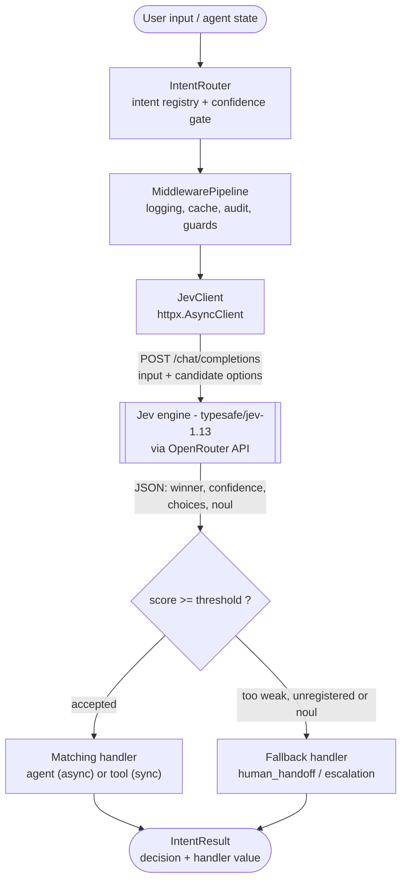

<div align="center">

# jev-route

**An AI agent intent & tool router for Python.**
JevRoute sits in front of your agents, tools and model calls: it asks the Jev
decision engine *which* capability should handle an input, applies a confidence
gate, and only then invokes the matching handler.

[](https://github.com/jevroute/jev-route/actions/workflows/ci.yml)
[](https://www.python.org/downloads/)
[](LICENSE)
[](https://docs.astral.sh/ruff/)
[](https://mypy-lang.org/)

</div>

---

## Architecture

JevRoute never answers the user itself — it decides **who should**, and hands the
work over. The Jev engine (`typesafe/jev-1.13`) is reached through OpenRouter's
OpenAI-compatible `/chat/completions` endpoint.



### Why a decision layer?

Most agent stacks hard-code routing with `if/elif` chains or let the main model
free-style tool selection. JevRoute separates that concern:

| Step | What happens | Where |
| --- | --- | --- |
| 1. Offer | You register the intents, agents and tools you own | `IntentRouter.register()` / `.intent()` / `.tool()` |
| 2. Ask | The input plus the option list goes to the Jev engine | `JevClient.decide()` |
| 3. Gate | A winner below your threshold is **not** trusted | `JevDecision.evaluate()` |
| 4. Act | The winner (or the fallback) is executed | `IntentRouter.route()` |

Because the gate lives in the routing layer, a weak or hallucinated answer can
never silently reach a privileged tool: it escalates to your fallback instead.

## Features

- Async `JevClient` on `httpx.AsyncClient` (OpenRouter-compatible, retries included).
- Typed Jev data structures: `Score`, `Choice`, `Noul`, `JevResponse`, `JevDecision`.
- `IntentRouter` with **confidence gate** and fallback/escalation handling.
- Async **middleware pipeline** shared by intent resolution and agent loops
  (`LoggingMiddleware`, `CacheMiddleware`, plus your own).
- Transport-agnostic decision models: no framework lock-in, testable offline.
- Strict quality gates: `ruff`, `mypy --strict`, `pytest` (all green in CI).

## Installation & Quickstart

## Installation & Quickstart

**Requirements:** Python 3.10+ and an OpenRouter API key (or any Jev-compatible
gateway exposing the OpenAI chat completions protocol).

### 1. Install

```bash
# from PyPI (once released)
pip install jev-route

# or, editable for development (ruff, mypy, pytest included)
git clone https://github.com/jevroute/jev-route.git
cd jev-route
python -m pip install -e ".[dev]"
```

### 2. Provide credentials

JevRoute reads the key from the environment — never hard-code it.

```powershell
# Windows PowerShell
$env:OPENROUTER_API_KEY = "sk-or-..."
```

```bash
# bash / zsh
export OPENROUTER_API_KEY="sk-or-..."
```

### 3. Route your first prompt

```python
import asyncio

from jev_route import IntentRequest, IntentRouter, JevClient


async def main() -> None:
    # 1. The Jev engine, reached through OpenRouter.
    async with JevClient() as client:
        # 2. Build the router: options + confidence gate + fallback.
        router = IntentRouter(
            client,
            name="support-desk",
            confidence_threshold=0.6,
            fallback_label="human_handoff",
        )

        @router.intent(
            "weather_agent",
            description="current weather and short forecasts for a city",
            examples=("How is the weather?",),
        )
        async def weather_agent(request: IntentRequest) -> dict[str, str]:
            return {
                "agent": "weather_agent",
                "city": request.context.get("city", "Istanbul"),
                "forecast": "partly cloudy, 21 C",
            }

        @router.tool("calculator_tool", description="plain arithmetic")
        def calculator_tool(request: IntentRequest) -> dict[str, int]:
            return {"result": 96}

        @router.fallback(label="human_handoff")
        async def human_handoff(request: IntentRequest) -> dict[str, str]:
            return {"escalated": True, "why": request.decision.reason}

        # 3. Decide *and* execute in a single call.
        result = await router.route("How is the weather?", context={"city": "Berlin"})
        print(result.label)            # weather_agent
        print(result.value)            # {'agent': 'weather_agent', 'city': 'Berlin', ...}
        print(result.decision.score)   # 0.94
        print(result.decision.reason)  # the winner passed the confidence gate


asyncio.run(main())
```

Prefer to decide and act separately? Use `await router.decide(text)` for a
gate-checked `JevDecision`, then `await router.execute(decision)` to run the
selected handler.

### 4. Try it with zero tokens

The bundled example replays canned Jev answers through an `httpx.MockTransport`
whenever no API key is set, so the whole flow runs offline:

```bash
python examples/basic_routing.py
```

It routes four prompts — a confident match, a tool call, a weak winner that trips
the confidence gate, and an out-of-scope request that abstains — then prints an
audit trail collected by the middleware.

### Run the tests

```bash
python -m pytest          # 9 offline tests, no API key required
```

### Configuration

JevRoute is configured through `JevSettings.from_env()`; every value can also be
passed explicitly (e.g. `JevClient(api_key=..., model=...)`).

| Environment variable | Default | Purpose |
| --- | --- | --- |
| `OPENROUTER_API_KEY` / `JEV_API_KEY` | *(empty)* | Bearer token for the gateway |
| `JEV_MODEL` | `typesafe/jev-1.13` | Decision model identifier |
| `JEV_BASE_URL` | `https://openrouter.ai/api/v1` | API root (any OpenAI-compatible Jev gateway) |
| `JEV_CONFIDENCE_THRESHOLD` | `0.6` | Default confidence gate |
| `JEV_TIMEOUT` | `30` | Per-request timeout in seconds |
| `JEV_MAX_RETRIES` | `2` | Extra attempts for timeouts, `429` and `5xx` |

## Project layout

```
jev-route/
├── .github/workflows/ci.yml   # ruff + mypy + pytest + build (Python 3.10-3.12)
├── LICENSE                    # MIT
├── README.md
├── documentation.md           # roadmap, architecture decisions, live status
├── pyproject.toml             # packaging + ruff/mypy/pytest configuration
├── examples/
│   └── basic_routing.py       # offline-capable end-to-end demo
├── tests/
│   └── test_jev_route.py      # smoke tests driven by the example
└── src/
    └── jev_route/
        ├── __init__.py        # public API
        ├── core.py            # Jev data structures, JevClient, confidence gate
        ├── router.py          # IntentRouter: registration, decide, execute
        └── middleware.py      # async middleware pipeline
```

## Development

```bash
python -m pip install -e ".[dev]"

python -m ruff check .     # lint          -> All checks passed!
python -m mypy src         # type check    -> Success: no issues found
python -m pytest           # tests         -> 9 passed
```

All three gates run in CI on every push and pull request; see
[`documentation.md`](documentation.md) for the roadmap and current status.

## License

MIT — see [LICENSE](LICENSE).


